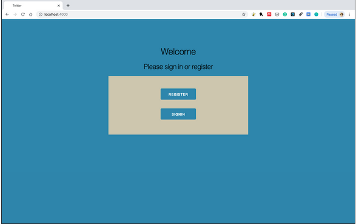

# Twitter_app

## About 
For this project, Phoenix framework along with WebSockets and Phoenix channels was used to create an authenticated real-time web interface for a twitter-like engine. Six functionalities were implemented in this project. The first functionality is to register the account and delete the account. The second is to send tweets, the third is to subscribe to other users. Re-tweeting, querying and delivering live tweets are the fourth, fifth and sixth functionality respectively.

## Link to Demo
Youtube: https://www.youtube.com/watch?v=Mx7D40QpGv0&feature=youtu.be

Google Drive: https://drive.google.com/open?id=1HfO9w7o9Al8p4VtPUwwYp_yL1Spy1oG6

## How to run the website and simulation
When the website is started a simulation of 100 users is created who start sending tweets to each other before the user logs in. This is so that the user has data to interact with when they first log on. To run the web interface navigate to the directory (/LaurenceauSaxena/twitter) and:

- Install dependencies with mix deps.get
- Create and migrate your database with mix ecto.setup
- Install Node.js dependencies with cd assets && npm install
- Start Phoenix endpoint with mix phx.server

Now localhost:4000 from your browser. You should be able to see Figure.

  

## Phoenix 

  

See the official site at https://www.phoenixframework.org/

Install the latest version of Phoenix by following the instructions at https://hexdocs.pm/phoenix/installation.html#phoenix

  
